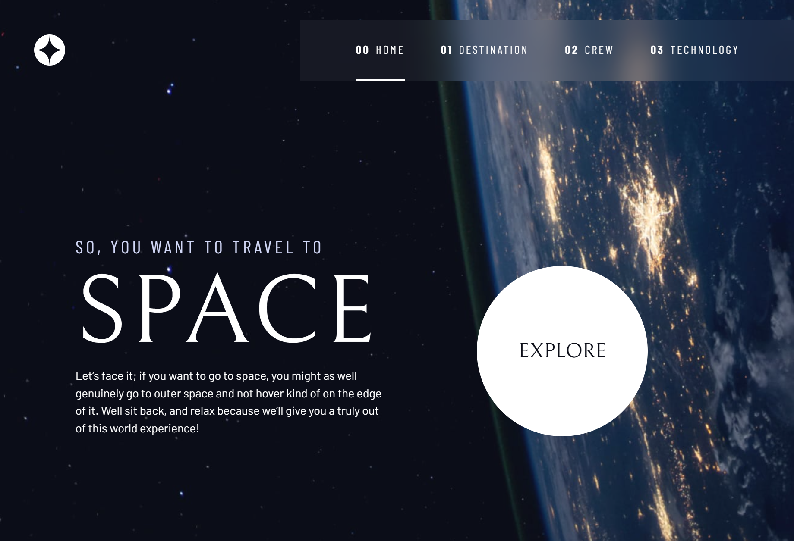

# Frontend Mentor - Space tourism website solution

This is a solution to the [Space tourism website challenge on Frontend Mentor](https://www.frontendmentor.io/challenges/space-tourism-multipage-website-gRWj1URZ3).

## Table of contents

- [Overview](#overview)
  - [The challenge](#the-challenge)
  - [Screenshot](#screenshot)
  - [Links](#links)
- [My process](#my-process)

  - [Built with](#built-with)
  - [What I learned](#what-i-learned)
  - [Continued development](#continued-development)

- [Author](#author)
- [Acknowledgments](#acknowledgments)

## Overview

### The challenge

Users should be able to:

- View the optimal layout for each of the website's pages depending on their device's screen size
- See hover states for all interactive elements on the page
- View each page and be able to toggle between the tabs to see new information

### Screenshot

### Links

- Live Site URL: [https://space-travel-site-rho.vercel.app/](https://space-travel-site-rho.vercel.app/)

## My process

### Built with

- Semantic HTML5 markup
- CSS custom properties
- Flexbox
- CSS Grid
- Mobile-first workflow
- JavaScript

### What I learned

I learned a lot from doing this project. My main takeaways are:

- grid-area is a very versatile tool when utilizing CSS grid.
- refactoring js to make code reuseable.
- The importance of accesibility in websites. In particular adding a skip-to-content hidden accesibility link, which most major websites use.
- making use of aria attributes when selecting elements in javaScript.

### Continued development

This site would be well suited to be built in React or another framework. I chose to use vanilla js as i was mainly focussing on improving my CSS.

## Author

- Website - [Ashir Valjee](https://ashir-valjee-portfolio.vercel.app/)

**Note: Delete this note and add/remove/edit lines above based on what links you'd like to share.**

## Acknowledgments

Kevin Powells excellent CSS resources
